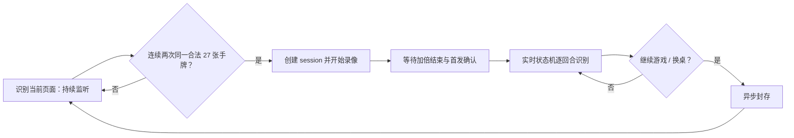

# 实时策略助手使用与维护说明

本文说明“实时助手”页面的自动闭环、识别边界、日志含义及回归测试方式。它对应当前项目的实现；如果页面文字与旧截图或旧说明不一致，以本文和代码为准。

## 使用流程

1. 打开腾讯大掼蛋牌桌，并保持窗口位置、缩放比例和分辨率不变。
2. 在“实时助手”页点击 **识别当前页面（持续监听）**。程序自动显示极简推荐浮窗并把完整助手最小化到后台；此后无需再点“开始实时对局”。
3. 监听页面持续更新预览、级牌、首发候选和初始手牌；在“对局录制”或“不保存”方式下，此阶段不新建目录、不保存录像。
4. “保存方式”默认是“对局录制”：当连续两次采样识别到**同一份、已规范化的 27 张手牌**，并且级牌在合法范围内时，程序创建 session 和录像并进入“等待首出”。选择“不保存”时仍完整运行实时识别和模型建议，但不写入文件；选择“全程录制”时，从点击持续监听开始就保存一段独立录像，即使起手牌未识别成功也会保留，确认起手牌后再另建完整对局录像。该选择会记住，并在开始监听后锁定。
5. 加倍或超级加倍控件存在期间，只显示“正在决定是否加倍”；不提交首发，也不识别动作。控件消失后，首发状态机才会根据 `first_play` 标志和稳定性要求确认首发。
6. 对局结束时，只要按钮区域识别到 `continue_game.png`（继续游戏）或 `change_table.png`（换桌），程序写入结算事件、异步封存本局并自动恢复监听页面。

自动开始只接受两次完全相同的完整手牌。以下任一种情况都会继续监听而不会开局：手牌不是 27 张、两次牌面不同、级牌为空或无效、已有正在运行或正在封存的 session。

## 极简推荐浮窗与采集安全

极简浮窗保持 `500×245` 的紧凑尺寸，顶部固定显示当前墩的 `自己｜右家｜对家｜左家` 出牌轨道，当前行动者高亮；下方只保留大号建议、单行牌面、耗时和采集安全提示。完整历史、回放、标注、模板与诊断仍保留在后台完整助手。两个窗口共享同一个 `LiveAssistantController`、`LiveOrchestrator` 和当前策略模型，不会启动第二套识别或重复请求。点击“打开完整助手”可恢复主窗口；关闭浮窗只隐藏浮窗并恢复主窗口，不会自行结束对局。

配置的采集后端为 `auto`，按以下顺序工作：

1. 优先使用 `PrintWindow` 后台窗口采集。前台窗口覆盖牌桌不会进入采集画面。
2. 后台采集不可用时才回退 `screen` / `gdi_screen`。
3. 可见屏幕采集会枚举目标窗口上方的重叠窗口。发现遮挡后，该帧在录像、识别与策略计算之前被拒绝，实时流程暂停并提示移动窗口。

浮窗会优先放在牌桌客户区的右、左、下或上方。如果单屏没有安全空位，应缩小/移动牌桌或使用后台采集；不得把浮窗覆盖在牌桌上继续屏幕识别。

## 状态与线程边界



- `LiveAssistantController` 管理采集、监听和封存线程。所有窗口更新均通过 PySide6 信号回到主线程。
- `ScreenshotRecognitionService` 只负责从图像输出识别结果；它不会创建 session，也不会写日志。
- `LiveOrchestrator` 是唯一可以推进牌局状态、发布动作/结果事件和触发策略请求的地方。
- `LiveSessionStore` 只在自动开始后创建，封存后保留在原目录；页面切换到下一局只清除可见时间线，不删除历史文件。

## 首发、加倍与动作识别

首发识别分两层，不能混用：

- “当前页面识别”显示的首发只是单图候选，用于帮助观察；任何一个加倍按钮（`double.png` 或 `super_double.png`）出现时，这个候选都会被清空。
- 已创建 session 后，`waiting_lead` 状态机只读取开局标志、计时器和加倍控件。只有加倍控件消失并满足首发稳定条件后，才发布 `lead_player_confirmed`。

动作推进遵循固定座次：`自己 → 右家 → 对家 → 左家 → 自己`。当前玩家出牌/不出确认后，状态机只关心下一位应行动玩家的区域。`不出`不通过“区域为空”推断，而是只使用当前座位对应的 `passed.png` 模板。两帧相同且花色完整的结果即可确认；若任一张为 `rank?`，同一结果会再观察一帧。连续三帧的点数多重集和张数一致，即使花色在 `?`、黑色或红色候选之间抖动，也会提交保守的 `rank?` 牌面并合并花色候选；不会为了等待花色而漏掉整手牌。

一组稳定可见的出牌是已经发生的界面事件，规则层只负责枚举万能牌解释和选择能压桌面的最强组合，不能以“未压过桌面”为由拒绝提交，更不能让稍后出现的“不出”覆盖它。结构上不可能的瞬态 OCR 结果仍会被过滤；如果画面已经明确切换到下一家，穷尽采样后仍无法解释牌型，则按可见物理牌继续提交并附加审计警告，保证流程不阻断。行动切换发生较晚时，新玩家区域即使已经静态显示牌面也会在激活时采样；牌型特效仍只负责延后读取，特效结束后的静态牌不会被漏掉。

## 策略建议显示

状态机已确认轮到自己时会立即异步请求当前策略模型。时间线只显示两个面向用户的结果：青绿色“模型建议”，或红色“模型计算失败”。“请求已发出”和内部 `visible` 旁证不再单独写入时间线，避免把正常的异步计算误解为需要人工处理的状态。同一请求从后台完成变为当前可见时不会再追加一条；用户日志只显示核心建议、牌面和耗时，不显示内部请求编号。

因此，模型完成并不需要等待下一帧旁证才展示；快速“不出”也不会吞掉已经算出的建议。`visible` 字段仅供内部旁证与审计，不表示建议是否存在。

首次建议较慢通常来自本地模型权重加载。页面打开和持续监听开始时都会在后台预热当前策略；同一个控制器会复用该策略实例，后续建议只进行推理。时间线和 `advice.jsonl` 会记录请求编号与耗时，便于区分预热和推理问题。

## 对局动态与赛果事件

“对局动态”统一显示状态机事件和模型建议，并支持鼠标选择、复制和自动滚动到底部。一条出牌只占一个时间线条目，所有牌复用统一的花色卡片样式；日志不会把内部码（例如 `2D`）作为用户可见牌面。单张花色受遮挡时显示为红色 `？` 牌面，悬停可查看候选花色，而不是丢弃整组牌或把整手标成“花色待定”。

| 事件 | 含义 | 显示样式 |
| --- | --- | --- |
| `player_played` | 某座位已确认出牌 | 可见牌面 |
| `player_passed` | 当前座位通过 `passed` 模板确认不出 | 灰紫色“⏭ 不出” |
| `turn_started` | reducer 已切换到下一行动座位 | 蓝色 |
| `player_finished` | 某位玩家剩余牌变为 0 | 头游/二游/三游/末游的区分色 |
| `wind_caught` | 出完牌的领出者在一墩结束后将领出权交给队友 | 紫色“接风” |
| `suit_corrected` | 我方出完后从左家区域复核到最近一次遮挡花色 | 琥珀色“花色修正”；只追加日志，不改 reducer 状态 |
| `game_end_detected` | 识别到继续游戏或换桌 | 琥珀色，随后自动封存 |
| `recognition_retry` | 当前帧或当前策略尚不能提交动作 | 点数冲突时为琥珀色“继续识别”；空窗口超时会静默重新监听；不推进状态 |

`wind_caught` 是只追加的生命周期事件。`player_finished` 通常由已确认动作的剩余牌数产生；当最后一手长期受遮挡时，也可由固定游次标识进行保守恢复，此时会把该玩家的剩余数设为 0 并同步给当前策略，但不会伪造任何牌面。

游次模板至少需要 0.90 置信度、连续稳定出现，并且只能按头游 → 二游 → 三游的顺序提交；不符合当前阶段的标签会连同累计帧数一起丢弃。若标识属于当前行动者，会先等待六个稳定帧，让正常的最后一手识别优先完成。第三名一经产生，四个名次已能确定，reducer 会清空当前墩并把 `current_player` 设为空。此后只轮询结算按钮，绝不伪造末游的“不出”、接风、回合开始或新的策略请求。当前应行动座位仍是唯一能提交正式动作的区域；当左家刚出完、轮到自己且左家最近一手带 `?` 时，或自己已经出完后，同一帧可额外读取左家出牌区。只有连续两帧的点数多重集和张数完全吻合、且全部花色明确时才追加 `suit_corrected`；不会修改剩余牌数、当前回合、牌型、reducer 历史或策略输入。

## 遮挡花色与牌型特效模板

`rank?` 仍是正式出牌的一张牌，会参与张数、回合和游次推进。它的候选花色仅供临时校验与策略分支使用，不会覆盖时间线中的原始视觉记录。若一张早期的未知花色与后续清晰牌造成双副牌计数冲突，后续清晰牌仍可提交；系统仅放宽那张历史 `?` 的候选约束，并在动作 payload 的 `integrity_warnings` 记录 `historical_suit_constraints_relaxed`。明确读到的花色、当前出牌和我方手牌仍保持严格校验。

在“标注与模板”页面把模板类型选为“牌型特效”即可采集：单张、对子、三张、三带二、钢板、三连对、连对、顺子、炸弹、同花顺、天王炸。请定位到特效文字最清晰的一帧，并只框选特效主体（不包含出牌牌面）；默认每类只采集一张关键帧，只有该帧对某种缩放或动画阶段漏检时才补充第二张。特效模板只用作读牌门控：命中会丢弃已经采集的突发帧，待特效消失后至少静止 450ms 再识别，不会据此直接判定牌型。

## Session 文件与排障入口

“对局录制”和“全程录制”都会在完整对局开始后写入：

```text
data/profiles/tencent_daguandan/sessions/game_YYYYMMDD_HHMMSS_<id>/
  manifest.json
  timeline.jsonl
  timeline.md
  observations.jsonl.gz
  advice.jsonl
  video/game.avi
  video/frame_index.jsonl
  incidents/INC-*/
```

- `timeline.jsonl`：已发布的正式动作和辅助生命周期事件，是机器可读的时间线。
- `timeline.md`：中文时间线投影，方便人工检查首发、座次、接风和游次。
- `observations.jsonl.gz`：每次视觉候选、置信度、拒绝理由和帧索引；用于复现“为什么没提交”。
- `advice.jsonl`：策略请求、推荐、耗时、`engine_input` 及待确认/已确认状态。
- `video/frame_index.jsonl`：录像帧与单调时间戳的对应关系；用于回放复测定位异常帧。
- `incidents/`：超时、候选冲突、非法牌型、采集异常或模型异常时的诊断包。

排障建议：先从时间线找到“第 N 手”的异常，再查同 session 的 `observations.jsonl.gz` 和 `frame_index.jsonl` 定位帧；需要看动画或特效时再打开录像。不要通过删除 session 来“重置”页面，下一局会自动重新监听。

## 本次回归测试

本次改动新增/调整的测试不生成视频，也不会扫描所有历史录像，因此不会显著占用磁盘。执行前请在项目根目录运行：

```powershell
$env:PYTHONPATH = "src"
$env:QT_QPA_PLATFORM = "offscreen"
conda run -n yhx python -m pytest -q `
  tests/test_recognition_service.py::test_fast_signals_recognize_continue_game_as_an_end_control `
  tests/test_recognition_service.py::test_fast_signals_recognize_change_table_as_an_end_control `
  tests/test_recognition_service.py::test_opening_signal_carries_change_table_end_control `
  tests/test_live_orchestrator.py::test_continue_game_control_emits_one_game_end_event `
  tests/test_live_orchestrator.py::test_finished_player_and_wind_catch_are_emitted_to_the_timeline `
  tests/test_live_controller.py::test_listener_starts_session_after_two_identical_complete_hands `
  tests/test_live_controller.py::test_listener_does_not_start_session_when_complete_hand_changes `
  tests/test_live_controller.py::test_listener_treats_different_recognition_order_as_the_same_hand `
  tests/test_live_controller.py::test_controller_auto_finishes_once_when_game_end_is_detected `
  tests/test_live_controller.py::test_controller_resumes_waiting_listener_after_sealing_when_enabled `
  tests/test_live_advice.py::test_ready_advice_notifies_ui_without_waiting_for_another_capture_frame `
  tests/test_live_assistant_page.py::test_live_page_starts_persistent_listener_without_manual_start_button `
  tests/test_live_assistant_page.py::test_live_page_does_not_show_a_lead_candidate_during_normal_double `
  tests/test_live_assistant_page.py::test_live_page_shows_unconfirmed_pass_advice_instead_of_hiding_it `
  tests/test_live_assistant_page.py::test_live_page_renders_all_action_and_outcome_events_from_one_update `
  tests/test_live_assistant_page.py::test_live_page_uses_compact_hand_strip_and_has_no_quick_correction_controls
```

完成定向回归后，再运行完整相关模块：

```powershell
$env:PYTHONPATH = "src"
$env:QT_QPA_PLATFORM = "offscreen"
conda run -n yhx python -m pytest -q `
  tests/test_recognition_service.py `
  tests/test_live_orchestrator.py `
  tests/test_live_controller.py `
  tests/test_live_advice.py `
  tests/test_live_assistant_page.py
```

本轮已执行针对花色确认、赛果终止、左家只读花色修正、实时页面与编排器的定向测试；完整项目测试和真实录像视觉复测应在交付前继续执行。
