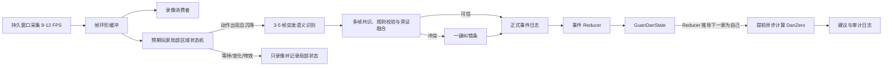

# 实时 DanZero 半自动对局助手设计

## 1. 背景

项目当前已经具备以下能力：

- `CaptureService` 能定位腾讯大掼蛋窗口并生成 1280×720 标准化截图；
- 区域与模板模块能维护手牌、出牌、计时器、首出、不出、按钮和特效模板；
- `ScreenshotRecognitionService` 能从单张图片识别级牌、手牌、当前行动者、首出者和各座位动作；
- `SingleImageDanzeroPage` 能人工修正单帧识别结果并调用 DanZero；
- `GuanDanState` 和 `DanzeroAdvisor` 能校验完整牌局状态、生成建议并保留 `engine_input` 审计数据。

实时模式不能简单地反复调用单图页面。单帧结果缺少跨帧稳定判定、动作去重、回合推进、错误纠正和对局级数据隔离。本设计在保留单图诊断能力的基础上，新增独立的实时会话引擎。

### 1.1 参考项目复盘

本设计参考 `tianqiraf/DouZero_For_HappyDouDiZhu` 的提交
`c01062592f362cfb77d6af14a34c2cbcfa614fd2`。该项目最有价值的机制是：按固定行动顺序只监听预期玩家的局部出牌区，等待“空白区域 → 出牌/不出”变化，识别后只调用一次 `env.step()` 推进模型环境；开局还会校验地主牌和三家手牌数量。

不能照搬的部分包括：1920×1080 硬编码坐标、GUI 主线程轮询、固定等待约 500ms 后单帧识别、只识别点数而忽略花色，以及没有日志、纠错和回放。该仓库记录的“王炸特效可能只识别到一个王”也说明固定等待和单帧读取不足以处理长特效。

因此本设计从“全局关键区域共同稳定”修订为“预期玩家局部区域生命周期 + 动态沉降 + 稳定帧突发识别 + 规则和旁证融合”。

## 2. 目标与范围

### 2.1 目标

- 用户手动开始和结束一局对局；程序在此期间持续采集游戏画面。
- 程序自动维护按逆时针方向推进的牌局状态：
  `自己 → 右家 → 对家 → 左家 → 自己`。
- 特效或过渡动画期间暂停业务识别，画面稳定后再识别动作。
- 只有状态可信且轮到自己时才调用 DanZero，每个 `turn_id` 最多生成一次有效建议。
- 自动记录大模型易读的中文时间线和机器可重放的结构化日志，每局物理隔离。
- 记录连续视频，并支持确定性状态重放和视频重新识别。
- 发生冲突时，常见情况通过一个候选按钮完成纠错；罕见无正确候选的情况提供简化补录。
- 自动生成包含关键帧、状态差异和 DanZero 输入的大模型诊断包。

### 2.2 第一版不做

- 不控制游戏窗口，不发送点击、键盘或自动出牌操作。
- 不自动判断对局开始和结束。
- 不支持中途接入已经开始的对局。用户必须在首家出第一手牌之前开始会话，并确认初始手牌稳定识别为完整 27 张。
- 不识别炸弹、顺子等特效的具体名称。
- 不静默接受低置信度或上下文不合法的猜测。
- 不提供任意历史位置的复杂对局编辑器；实时纠错只处理待确认事件和最近一次正式事件。
- 不用当前单图对话框承载实时会话状态。

## 3. 核心设计原则

1. **事件溯源**：正式牌局状态只由不可变事件日志重建，不以某一帧快照覆盖状态。
2. **观察与事实分离**：识别器只产生候选观察；多帧共识和规则校验通过后才成为正式事件。
3. **准确优先**：无法安全判定时继续录像但暂停状态推进和 DanZero 调用，等待后续证据或人工确认。
4. **局部事件驱动**：只监听当前预期玩家的出牌区生命周期；局部画面沉降后再判断语义结果是否足以提交。
5. **最新帧优先**：识别积压时丢弃过时的待识别任务，绝不让延迟随对局持续增长。
6. **完整可追溯**：每个正式事件都能追溯到观察、关键帧、置信度、状态版本和采用原因。

## 4. 总体架构



### 4.1 复用现有模块

- `capture_service.py`：保留单次截图和已有截图会话 API。
- `recognition_service.py`：保留 `recognize()` 的行为，供单图诊断继续使用。
- `danzero/state.py`：继续作为 DanZero 的已确认状态模型。
- `danzero/advisor.py`：继续负责模型预加载、状态校验、推理和审计输入。
- `profiles.py`、区域配置和模板资产：作为实时识别的唯一配置来源。
- `gui/single_image_danzero_page.py`：继续作为单帧识别和模板诊断工具。

### 4.2 新增模块

新增 `src/daguandan_bridge/live/`：

- `models.py`：帧、观察、候选事件、正式事件、纠错、事故和回放结果模型。
- `stability.py`：单座位出牌区占用状态、ROI 运动评分、迟滞阈值、动态沉降和特效阻断。
- `consensus.py`：按 `turn_id` 聚合多帧候选并输出可信度与冲突原因。
- `state_machine.py`：对局生命周期、单座位区域生命周期和行动循环状态机。
- `reducer.py`：从正式事件及纠错事件确定性重建牌局状态。
- `session_store.py`：对局目录、JSONL、Markdown 时间线、清单和事故包写入。
- `recorder.py`：视频编码、帧时间戳索引、环形缓冲和关键帧保存。
- `replay.py`：虚拟时钟、事件重放、视频帧源和新旧结果对比。
- `orchestrator.py`：连接采集、识别、状态机、存储、DanZero 和 GUI 信号。

新增 GUI 页面：

- `gui/live_assistant_page.py`：实时画面、当前状态、建议、循环日志和一键纠错。
- `gui/replay_page.py`：对局选择、视频控制、事故跳转、状态重放和视频重新识别。

## 5. 统一座位与回合规则

项目定义唯一常量：

```text
TURN_ORDER = (self, right, opposite, left)
```

从任一座位开始，都按该元组循环推进。现有 `recognition_service.py` 中的
`SEATS_IN_ORDER = (self, left, opposite, right)` 与实际逆时针顺序不一致，必须改为复用统一常量；单图识别结果排序和实时状态机不得各自维护一套顺序。

状态中维护每家剩余牌数和已出完座位。某家确认出牌后剩余数为 0，则追加 `player_finished`。推导下一行动者时跳过已出完座位。Reducer 的逆时针顺序是主要推进依据；屏幕计时器、我方动作按钮和下一座位局部变化是外部旁证。推导值和多个旁证持续不一致时进入人工确认，而不是自动覆盖。

本墩维护最后一个非不出玩家。当其他仍在场玩家均确认不出，或动作证据可靠地回到最后非不出玩家时，追加 `trick_started` 并清空当前墩动作。计时器单独换人不能直接推断“不出”；只有“当前玩家区域始终为空 + 下一回合至少一个独立旁证”同时成立时，才能生成 `inferred_pass` 候选。半自动第一版默认要求用户一键确认该候选。

## 6. 状态机

### 6.1 对局生命周期

```text
IDLE
  └─手动开始→ INITIALIZING
                  ├─初始字段稳定→ RUNNING
                  └─无法确认→ REVIEW_REQUIRED
RUNNING ⇄ REVIEW_REQUIRED
RUNNING ⇄ PAUSED
RUNNING/PAUSED/REVIEW_REQUIRED ─手动结束→ FINALIZING → SEALED
```

`INITIALIZING` 必须在首家第一次出牌前完成，至少确认级牌、百搭级别、完整 27 张初始手牌、当前行动者和本墩首出者。手牌数量、多重集合双副牌上限或首发字段不合法时拒绝进入 `RUNNING`。初始化未完成时可以录像，但不能调用 DanZero。

`REVIEW_REQUIRED` 继续采集和录像，但冻结 Reducer 的后续提交。用户确认后从最后一个可信状态继续；结束对局时即使仍有未解决冲突，也会把冲突和未完成状态写入清单。

### 6.2 单座位出牌区生命周期

```text
WAIT_CLEAR
  └─上一动作残留消失→ WAIT_ACTION
WAIT_ACTION
  └─区域占用变化/不出出现→ CHANGING
CHANGING
  └─连续低运动→ SETTLING
SETTLING
  ├─满足动态沉降窗口→ BURST_READ
  └─再次高运动/effect 命中→ CHANGING
BURST_READ
  ├─获得足够稳定样本→ VALIDATE
  └─样本重新变化→ CHANGING
```

每个座位维护独立的区域状态，但运行时只激活当前预期玩家的检测器。`WAIT_CLEAR` 防止上一手残留被当作新动作；首发玩家没有上一动作残留时可直接从初始化进入 `WAIT_ACTION`。区域占用由背景/空白基线、牌面候选、不出模板和变化像素比例联合判断，不依赖某一张固定“白块”模板。

进入沉降使用较严格的低运动阈值，退出沉降使用较宽松的高运动阈值，形成迟滞，避免边界抖动。初始建议值为：

- 采集目标：10 FPS，可配置范围 8–12 FPS；
- 沉降窗口：连续 300–600 ms 低运动；
- 突发读取：沉降后选择 3–5 张稳定帧，间隔 80–150 ms；
- 语义共识：突发样本中至少 3 个相同合法牌组，或存在唯一可由规则证明的候选；
- 单动作等待上限：默认 15 秒；到期不猜测，进入人工确认。

这些值是初始工程参数，最终通过真实录像的 P50/P95/P99 数据校准，不作为不可修改的业务规则。

### 6.3 单次行动循环

```text
WAIT_TURN
  → ACTIVATE_ZONE(player, turn_id)
  → WAIT_CLEAR/WAIT_ACTION/CHANGING/SETTLING/BURST_READ
  → CANDIDATE(action)
  → VALIDATE
  ├─突发样本一致、顺序和牌型合法→ COMMIT
  ├─后续旁证排除冲突→ COMMIT
  └─仍冲突、超时或非法→ REVIEW_REQUIRED
COMMIT → ADVANCE_TURN → WAIT_TURN
```

候选事件的指纹至少包含 `turn_id`、玩家、是否不出和规范化牌组。因此上一手牌仍停留在桌面时，不会在新 `turn_id` 中仅因画面相同而重复提交。计时器切换不再是提交动作的硬条件；它与我方动作按钮、下一座位区域变化一起作为可记录权重的旁证。局部生命周期、语义共识和牌局规则已经充分证明动作时可以先提交，旁证晚到时只补充证据。

出牌牌组共识保留当前单图识别的点数/花色配对和横向去重，并在 3–5 张稳定帧之间按规范化牌码多重集合投票。与斗地主参考项目不同，不能把红黑花色折叠成点数，因为掼蛋的同点数不同花色、红桃级牌和双副牌重复实例都会影响合法牌型与 DanZero 输入。

### 6.4 自己回合与 DanZero

上一个动作提交后，只要 Reducer 推导下一家为自己、能生成无 `readiness_errors` 的 `GuanDanState`，且当前 `turn_id` 尚未成功请求建议，就立即异步调用 DanZero，不等待计时器稳定。这样模型推理可以与游戏换人动画并行。请求键为：

```text
(session_id, turn_id, state_revision)
```

同一个键只能产生一次有效建议。状态在建议返回前发生修正时，旧结果标记为 `advice_stale`，不显示为当前建议，并用新状态版本重新请求。建议可以提前算好，但只有计时器、我方动作按钮或其他我方回合旁证至少命中一个时，才标记为 `advice_visible`；若旁证显示不是我方回合，则丢弃推测结果并进入状态核对。

自己的实际出牌需要同时满足：

- 自己出牌区形成稳定候选；
- 出牌前后手牌均稳定；
- 手牌多重集合差值等于候选出牌；
- 牌型和当前墩规则合法。

若差值能唯一确定动作，可自动修正出牌区的漏识别；否则进入一键确认。

## 7. 连续采集与性能

### 7.1 并行流水线

- 采集器长期持有目标窗口句柄和截图上下文，避免每帧重新查找窗口和创建 `mss` 对象。
- 帧进入最近 10 秒的内存环形缓冲，同时分发给录像器和当前玩家的局部区域状态机。
- 录像器按目标 FPS 编码。编码来不及时不能静默丢帧；必须记录 `recording_frame_dropped` 并创建事故。
- 识别任务队列容量固定为 1。处理中的识别不取消，新到帧替换尚未开始的旧任务。
- 模板在会话开始时预加载和预处理，不在每次 `recognize()` 中重新读取磁盘。
- 模板或配置在标记页面保存后，通过版本号或文件哈希显式失效缓存；单图和实时识别共享同一缓存管理器。
- 快速路径每帧只处理锚点、当前玩家区域占用/运动、不出、计时器、我方按钮和 effect 阻断；区域进入 `BURST_READ` 后才对 3–5 张样本运行牌面识别，并在自己出牌后按需识别手牌。

### 7.2 局部沉降与证据融合

运动评分只使用当前预期玩家的出牌 ROI；自己出牌后额外启用手牌 ROI。其他座位、计时数字、头像和背景动画不参与本次动作的运动评分。当前行动者仍可使用 `timer/active` 模板判断，但只作为旁证。

ROI 先灰度化和轻度模糊，再计算相对空白基线的占用分数、相邻帧归一化绝对差分和变化像素比例。锚点缺失、当前 ROI 高运动、已知 effect 模板命中或窗口几何变化，都会让局部状态回到 `CHANGING`。effect 模板只作为“当前区域暂不可读”信号，不输出特效类别。

局部稳定并不等于事件可信。特效可能短暂停顿，上一手牌也可能保持静止；因此必须先经过 `WAIT_CLEAR`，再对稳定帧突发读取，并结合牌型、剩余牌数、行动顺序和旁证校验。固定睡眠 500ms 不作为正确性机制。

### 7.3 延迟预算

目标是轮到自己后 3 秒内显示建议，统计口径为 P95：

- 捕获新帧：0–100 ms；
- 动画后沉降：300–600 ms；
- 局部沉降、突发识别和共识：300–900 ms；
- 已预热 DanZero：目标不超过 2 秒；
- 总体：P95 不超过 3 秒。

每个阶段都写入单独耗时。15 秒回合在目标达成时保留约 12 秒给用户决策和操作。若基准测试未达标，先依据分段耗时优化实际瓶颈，不通过盲目降低稳定要求换取速度。

## 8. 对局数据与日志

### 8.1 单局隔离

```text
data/profiles/tencent_daguandan/sessions/
  game_YYYYMMDD_HHMMSS_<short-id>/
    manifest.json
    timeline.jsonl
    observations.jsonl.gz
    advice.jsonl
    timeline.md
    video/
      game.avi
      frame_index.jsonl
    incidents/
      INC-0001/
        incident.json
        llm_report.md
        clip.avi
        contact_sheet.png
        frames/*.png
        rois/*.png
        state_before.json
        state_after.json
        engine_input.json
```

目录名包含时间和随机短 ID，避免同秒启动冲突。所有记录包含 `session_id`。`manifest.json` 保存状态、开始/结束时间、应用版本、Python/依赖版本、profile、配置哈希、模板清单哈希、录像编解码器、目标 FPS、实际帧数、掉帧数和事故列表。

### 8.2 正式事件公共信封

```json
{
  "schema_version": 1,
  "session_id": "game_20260806_193015_ab12",
  "seq": 17,
  "event_id": "EVT-0017",
  "event_type": "player_played",
  "monotonic_ms": 18342,
  "wall_time": "2026-08-06T19:30:33+08:00",
  "trick_id": 2,
  "turn_id": 6,
  "actor": "right",
  "payload": {"cards": ["7S", "7H"]},
  "confidence": 0.94,
  "source": "multi_frame_consensus",
  "state_revision_before": 11,
  "state_revision_after": 12,
  "evidence_refs": ["OBS-0183", "frame:344"]
}
```

正式事件类型至少包括：

- `session_started`、`session_ended`；
- `initial_state_confirmed`；
- `trick_started`、`turn_started`；
- `player_played`、`player_passed`、`player_finished`；
- `manual_confirmed_event`、`event_correction`；
- `review_required`、`review_resolved`；
- `advice_requested`、`advice_ready`、`advice_failed`、`advice_stale`；
- `capture_interrupted`、`recording_frame_dropped`。

`timeline.jsonl` 只追加。每次关键业务事件写入后刷新文件；进程异常退出时最多损失末尾未完整的一行，读取器忽略该行并把会话标记为 `aborted`。

`observations.jsonl.gz` 保存被语义识别处理的帧，而不是所有录像帧。每条记录包含候选、候选分数、模板来源、ROI、视觉门状态、采用/拒绝原因和对应帧索引。结束会话后压缩；运行中先写未压缩临时文件，封存时转换，异常恢复时也能读取临时文件。

`advice.jsonl` 保存请求键、完整 `engine_input`、建议、分段耗时、成功/失败状态及对应状态版本。

### 8.3 大模型易读时间线

`timeline.md` 是从结构化事件生成的中文投影，不作为状态事实源。例如：

```text
[00:00.820][墩 T01][回合 R001] 首发确认：右家
[00:03.410][墩 T01][回合 R001] 右家出牌：[7S, 7H]，置信度=94%，证据=OBS-0183
[00:03.670][墩 T01][回合 R002] 轮到对家
[00:06.120][墩 T01][回合 R002] 对家不出，置信度=91%
[00:09.040][墩 T01][回合 R003] 左家出牌：[9C, 9D]
[00:09.380][墩 T01][回合 R004] 轮到自己
[00:10.250][墩 T01][回合 R004] DanZero 建议：[JC, JD]，请求=ADV-0004，状态版本=18
[00:13.560][墩 T01][回合 R004] 自己实际出牌：[JC, JD]，剩余手牌=21张
[00:13.820][墩 T01][回合 R005] 轮到右家
```

## 9. 一键纠错

### 9.1 待确认事件

当多个候选都合法，实时页面顶部显示非模态纠错条：关键帧、推荐候选、备选候选、“不出”和“都不对”。录像继续，但状态推进和新的 DanZero 调用暂停。

用户点击已有候选后，一次操作生成 `manual_confirmed_event`，记录：

- 被选择候选；
- 被拒绝候选及分数；
- 关键帧和观察引用；
- 用户确认时间；
- 确认前后的状态版本。

### 9.2 已提交的最近事件

若最近一条正式事件后来被证明错误，纠错条直接显示“改为候选 X”或“改为不出”。一次点击追加 `event_correction`，引用原 `event_id`，保存旧值、新值和原因，然后 Reducer 从最近可信检查点重建状态。

原事件永不覆盖或删除。这样既能恢复正确状态，也能保留程序最初的错误判断供诊断。

### 9.3 无正确候选

“都不对”打开最小补录面板，只要求选择玩家、出牌/不出和牌组。完全遮挡、短暂标记未被任何帧捕获或模板库缺失时，不能声称一次点击能安全纠正；在补录完成前暂停 DanZero。

## 10. 录像与事故包

### 10.1 录像格式

默认使用高质量 MJPEG/AVI，避免依赖 Windows 上不一定存在的 H.264 编码器。启动时检测 FFV1 支持；支持时允许用户选择无损 MKV。无论主视频编码如何，正式事件提交帧和事故关键帧都额外保存无损 PNG。

`frame_index.jsonl` 为每个视频帧保存：帧序号、原始 `monotonic_ms`、墙钟时间、源截图序号、是否丢帧和关联观察。回放使用该索引恢复原始时间，而不依赖播放器的固定 FPS 推测业务时间。

### 10.2 事故触发条件

- 多个候选在共识窗口内持续冲突；
- 计时器推进但没有可靠动作；
- 实际行动者与预期座位不一致；
- 手牌差值、剩余牌数、双副牌数量或牌型非法；
- 捕获中断、录像编码失败或掉帧；
- Reducer、识别器或 DanZero 抛出异常；
- 任一阶段超过配置的性能预算。

### 10.3 事故内容

事故包从 10 秒环形缓冲中保存触发前 5 秒，并继续收集触发后 5 秒。内容包括：

- 短视频和无损关键帧；
- 关键 ROI 裁剪及带标注联系表；
- 事故前后事件片段和全部冲突观察；
- 状态前后快照及字段级差异；
- 相关 DanZero `engine_input`；
- 配置、模板和程序版本哈希；
- 自动生成的 `llm_report.md`。

`llm_report.md` 首先给出异常摘要和最可能的失败阶段，再列出时间线、候选、采用/拒绝原因、状态差异、相关文件索引。用户通常只需提交该报告和 `contact_sheet.png`；需要检查动画时再附 `clip.avi`。

## 11. 回放

### 11.1 确定性状态重放

输入保存的观察或正式事件，并使用虚拟单调时钟代替真实等待。用于验证：

- 状态机转移；
- 多帧共识、去重和超时；
- 回合和墩推进；
- 纠错后的状态重建；
- DanZero 请求键与输入；
- 日志和事故触发。

相同输入、配置和随机种子必须产生完全相同的事件序列和状态快照。

### 11.2 视频重新识别

按 `frame_index.jsonl` 提供的原始时间戳解码录像，运行当前版本的稳定门和识别器。新事件按 `turn_id` 与原会话的人工确认黄金时间线比较，输出：一致、缺失、新增、内容变化、置信度变化和延迟变化。

录像压缩可能改变模板分数，因此视频重新识别用于视觉回归，确定性状态重放用于严格状态机回归。事故和正式事件的无损 PNG 用于对关键视觉差异做精确复测。

### 11.3 回放页面

页面提供：

- 对局目录选择；
- 播放、暂停、单帧、0.5×–4×和事故跳转；
- “状态重放”和“重新视觉识别”两种入口；
- 原结果与当前结果的逐 `turn_id` 对比；
- 导出大模型诊断包。

## 12. 实时助手页面

主窗口新增“实时助手”页，布局为：

- 左侧：标准化实时画面，叠加当前玩家、稳定门状态和必要 ROI；
- 中间：当前墩与整局中文时间线；
- 右侧：DanZero 建议、状态摘要、录像状态和一键纠错条；
- 顶部或底部：开始对局、暂停识别、恢复、结束并封存。

纠错条不使用模态对话框，不抢占游戏窗口。正常状态下收起；异常时显示大尺寸候选按钮。UI 只订阅不可变快照和信号，不直接修改 Reducer 内部集合。

## 13. 错误处理与恢复

- 锚点丢失或窗口不可捕获：进入 `PAUSED`，继续周期性尝试恢复；恢复后重新沉降，不沿用中断前的候选窗口。
- 识别任务异常：记录观察级错误；连续异常升级为事故并暂停状态推进。
- DanZero 异常或超时：保留牌局状态，记录 `advice_failed`，允许对当前状态手动重试，但不重复生成有效建议。
- 录像失败：牌局识别可以继续，但必须显著提示用户并创建事故；用户决定继续还是结束。
- 应用异常退出：下次启动扫描未封存会话，将其标为 `aborted`，保留可播放视频和完整 JSONL 行。
- 磁盘空间不足：开始前检查可用空间；运行中达到安全阈值时停止录像、记录事故并提示，不删除旧对局。

## 14. 测试策略与验收标准

### 14.1 单元测试

- 任意起始座位的逆时针顺序和已出完座位跳过；
- `WAIT_CLEAR → WAIT_ACTION → CHANGING → SETTLING → BURST_READ` 的局部区域生命周期；
- 区域占用基线、运动迟滞、动态沉降、effect 阻断和超时；
- 3–5 帧突发识别的多数、唯一合法候选、冲突、过期和最新帧策略；
- 同一 `turn_id` 去重和跨 `turn_id` 相同牌组不误去重；
- 计时器缺失但局部动作证据充分时允许提交，计时器单独换人时不直接提交“不出”；
- “区域持续为空 + 下一回合独立旁证”只生成待确认的 `inferred_pass`；
- 不出、出牌、墩结束和玩家出完的 Reducer 行为；
- `event_correction` 后重建结果与正确事件从头重放一致；
- Reducer 推导到自己后提前请求 DanZero、旁证到达后显示、过期结果丢弃和状态版本变化重试；
- JSONL 尾部损坏恢复、会话目录隔离和事故包引用完整性；
- 虚拟时钟回放不依赖真实睡眠。

### 14.2 集成测试

- 开局手牌不是完整 27 张或开始时已有出牌历史时拒绝启动；
- 使用合成观察序列覆盖“右家首发 → 对家 → 左家 → 自己 → 右家”的完整循环；
- 覆盖上一动作长时间残留后清空、当前区域变化、长特效、短暂静止和二次变化；
- 使用已有单图识别服务验证模板缓存前后结果兼容；
- 录制短视频后立即回放，验证帧索引、关键帧和事件时间映射；
- 在 DanZero 替身上验证只有可信的自己回合会调用一次；
- 模拟识别冲突，验证一键确认、修正、暂停和恢复；
- 模拟捕获掉帧、录像失败和异常退出，验证事故和恢复数据。

### 14.3 真实录像黄金集

黄金集至少覆盖：

- 普通单张、对子和多张组合；
- 连续多人不出；
- 炸弹、顺子等不同持续时间的特效；
- 上一手牌停留和新牌覆盖；
- 不出模板短暂出现、完全漏采以及通过下一回合旁证生成待确认候选；
- 自己手牌重新排列；
- 玩家出完后跳过座位；
- 窗口短暂遮挡、缩放或捕获掉帧；
- 低置信度候选的一键确认与错误事件修正。

每条黄金录像配套人工确认的事件序列。第一版上线验收要求：

- 正式事件无重复，事件顺序与黄金序列完全一致；
- 未经人工确认的缺失或错误事件数为 0；
- 不确定状态调用 DanZero 的次数为 0；
- 每个自己的 `turn_id` 最多一个有效建议；
- 纠错后状态与黄金事件从头重放结果完全一致；
- 建议总延迟目标 P95 不超过 3 秒，若测试机器未达标则不得通过性能验收；
- 人工点击已有候选后 300 ms 内恢复状态推进；
- 每个事故报告都能定位触发原因、相关观察、状态差异和对应画面。

## 15. 实施顺序

1. 建立事件模型、Reducer、统一逆时针座位顺序及对应单元测试。
2. 建立会话存储、循环日志、录像、帧索引和虚拟时钟回放。
3. 重构截图为持久采集源，为识别服务加入模板缓存、单座位区域占用检测、动态沉降和稳定帧突发识别，同时保持单图接口兼容。
4. 实现实时 Orchestrator、局部区域生命周期、证据融合、事故触发和 DanZero 提前幂等调用。
5. 实现实时助手页、回放页和非模态一键纠错条。
6. 建立真实录像黄金集，完成准确性、恢复性和 P95 性能校准。

每个阶段都应先完成对应自动化测试再连接下一层。实时采集开始前，确定性状态重放必须能够独立运行；这样后续视觉问题和状态机问题可以分开定位。
